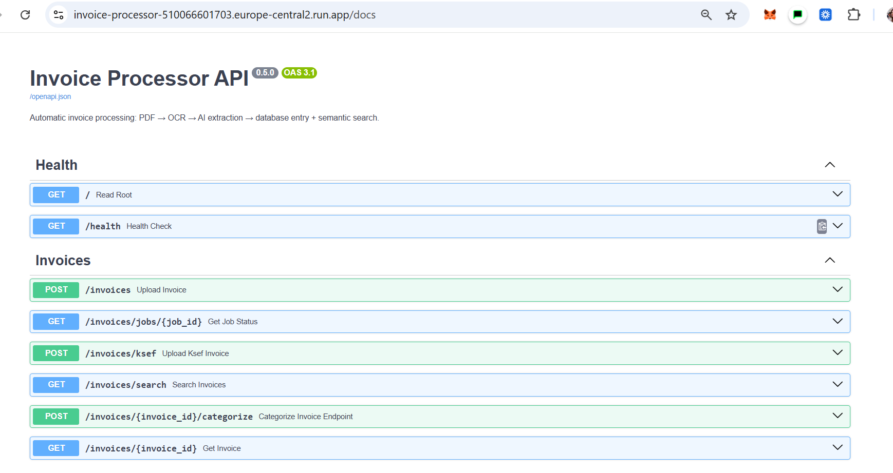
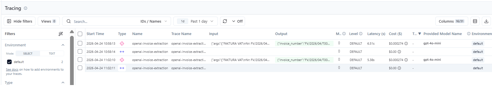
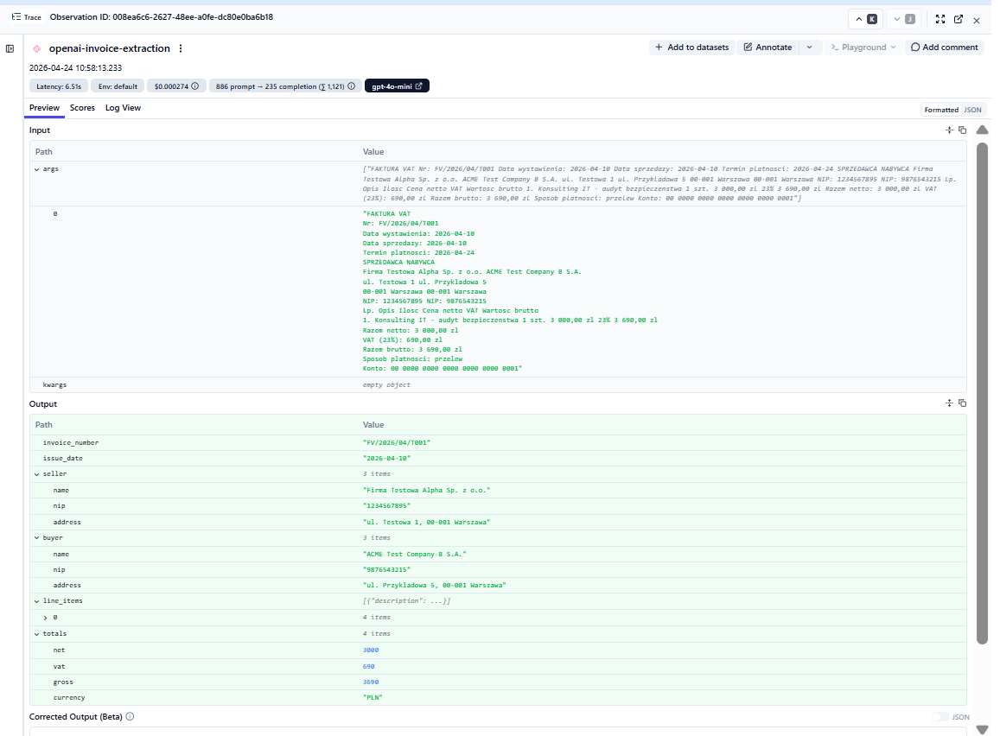
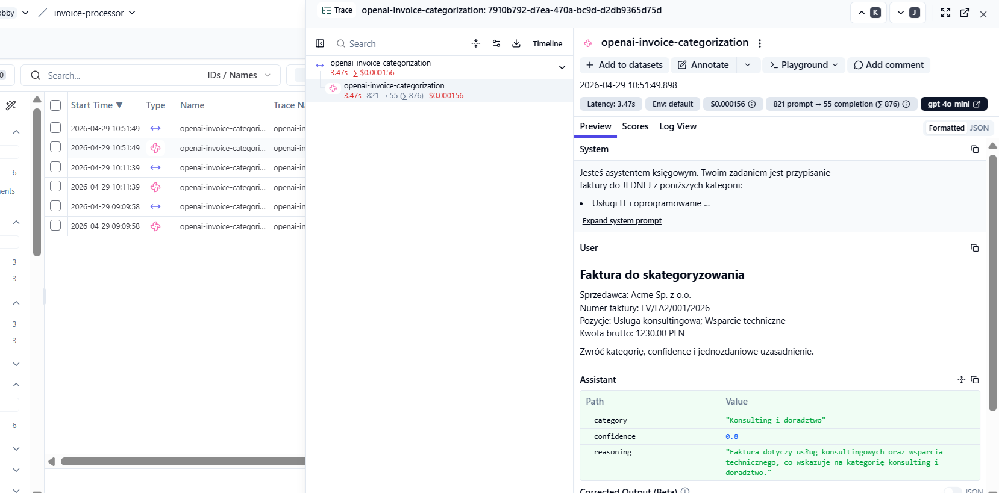
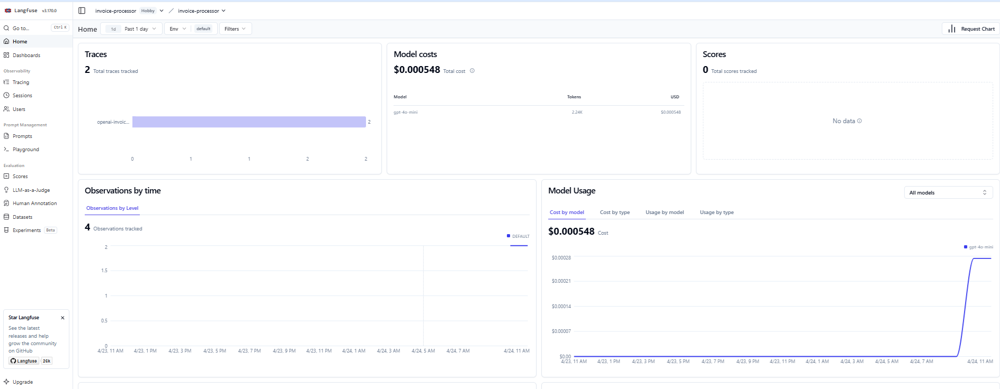

# Invoice Processor

> **KSeF-compatible invoice intelligence microservice.** Ingest a Polish invoice (PDF or KSeF XML), extract structured fields with an LLM, persist to Postgres, make the archive semantically searchable, and categorize via RAG over historical neighbours — all wrapped in production AI observability with per-call cost tracking.

## 🚀 Try it live (interactive Swagger UI, ~30 seconds)

**[https://invoice-processor-510066601703.europe-central2.run.app/docs](https://invoice-processor-510066601703.europe-central2.run.app/docs)**

Open Swagger → `POST /invoices/ksef` → *Try it out* → upload [`fa3_minimal.xml`](https://raw.githubusercontent.com/TatianaG-ka/invoice-processor/main/tests/fixtures/ksef/fa3_minimal.xml) (right-click → *Save link as…*) → *Execute* → see the parsed invoice + assigned `id`. Then browse with `GET /invoices`, classify with `POST /invoices/{id}/categorize`, and search semantically with `GET /invoices/search?q=Acme`. The full happy path is on the Swagger landing page itself.

> ⚠️ **First request may take ~10s** — Cloud Run cold start with `min-instances=0` (free-tier hosting). Retry once and it wakes up; subsequent calls respond in milliseconds.


[](https://www.youtube.com/watch?v=oLyzAMTcJ3M)


---

## Why I built this  

**KSeF XML becomes legally mandatory for all Polish B2B businesses in April 2026** (large taxpayers above PLN 200M revenue went live in February 2026). This translates to ~1.4M companies × ~1000 invoices/year = a structural compliance gap where **n8n + AI + observability** can replace manual copy-paste from PDF to Excel.

This project is intentionally scoped as a **flagship portfolio piece** demonstrating four capabilities that rarely co-exist in a single repo:

1. **Production deploy** — Cloud Run + multi-stage Docker + GitHub Actions CI with a live URL anyone can hit
2. **Polish regulatory compliance** — KSeF dual-schema FA(2) legacy + FA(3) current, against the real `crd.gov.pl` namespace
3. **AI observability with cost tracking** — Langfuse `@observe` on both LLM paths, measured $0.000156–$0.000274 / call
4. **Hybrid storage strategy** — Postgres as source of truth + Qdrant as refreshable embedding projection + Redis as idempotency cache

Each one alone is a "deployed demo." Together they make a "production-ready microservice."

---

## What it does

Polish businesses receive 60–100 invoices per month across three shapes: scanned PDFs, text-layer PDFs, and — from **April 2026**, mandatory for virtually every B2B business in Poland (large taxpayers above PLN 200M revenue went live in February 2026) — KSeF XML. This service normalises all of them into one typed record and surfaces three things that matter downstream:

1. **Structured fields** behind `GET /invoices/{id}` — seller, buyer, line items, totals, dates — all in a consistent JSON shape regardless of ingestion path.
2. **Semantic retrieval** behind `GET /invoices/search?q=...` — cosine similarity over sentence embeddings of seller name + line-item descriptions, so "find invoices about printer toner" works without exact-string matching.
3. **LLM categorization** behind `POST /invoices/{id}/categorize` — RAG over Qdrant neighbours + `gpt-4o-mini` few-shot, persisted to the `invoices` row. Idempotent: subsequent calls return the cached category from Postgres in <100 ms with no LLM hit; `?force=true` overrides for prompt iterations.

---

## Architecture


**The diagram shows the full flow:** the client/n8n sends requests to FastAPI, which either queues work through Redis + RQ (where the worker performs OCR and extraction with OpenAI) or parses KSeF XML directly. The result, ExtractedInvoice, is written in parallel to PostgreSQL and Qdrant; categorization uses RAG, with Qdrant neighbours passed as few-shot examples to OpenAI, and the result is stored back in PostgreSQL. Everything runs inside Cloud Run, while Langfuse collects traces from FastAPI. The dotted lines represent helper actions such as triggering categorization and reindexing on startup.

---

## Stack

| Layer | Technology | Notes |
|---|---|---|
| HTTP API | FastAPI 0.115 + Pydantic v2 | Async endpoints, automatic OpenAPI |
| Relational DB | PostgreSQL 16 (Neon managed in prod) | async SQLAlchemy 2.0 + asyncpg |
| Vector store | Qdrant 1.11 (embedded in prod, server in dev) | 384-dim cosine over MiniLM |
| Background queue | Redis + RQ 2.0 | `POST /invoices` (PDF) enqueues, worker does extract + persist + index |
| PDF text | pdfplumber → pytesseract + pdf2image OCR fallback | Scanned PDFs handled automatically |
| KSeF XML | lxml with dual-schema support | FA(2) legacy + FA(3) `http://crd.gov.pl/wzor/2025/06/25/13775/` |
| LLM extraction | OpenAI `gpt-4o-mini` Structured Outputs | Deterministic JSON, ~$0.000274/call |
| LLM categorization (RAG) | OpenAI `gpt-4o-mini` + few-shot from Qdrant top-3 neighbours | Persisted in `invoices.category`; idempotent endpoint, ~$0.000156/call |
| Embeddings | sentence-transformers `all-MiniLM-L6-v2` | 384-dim, multilingual, ~80 MB |
| Observability | Langfuse Cloud | `@observe` on OpenAI calls (extraction + categorization), token/cost tracking |
| Testing | pytest + pytest-asyncio + fakeredis + in-memory Qdrant | 155 tests, ~5 s full run |
| CI | GitHub Actions (ruff + pytest against real Postgres + Redis services) | Green gate on every push |
| Deploy | Google Cloud Run (Warsaw, `europe-central2`) | Multi-stage Dockerfile, Cloud Build from source |

---

## API reference

| Route | Shape | Notes |
|---|---|---|
| `GET  /health` | `{status: "healthy"}` | Liveness probe |
| `POST /invoices` | 202 + `{job_id, status_url}` | PDF upload, enqueues to worker |
| `GET  /invoices/jobs/{id}` | `{status, invoice_id, error}` | Poll job status |
| `POST /invoices/ksef` | 201 + `StoredInvoice` | KSeF XML, synchronous (fast parse) |
| `GET  /invoices/{id}` | 200 + `StoredInvoice` | Retrieve by DB primary key |
| `GET  /invoices/search?q=...&limit=10` | 200 + `SearchResponse` | Semantic search, DB-hydrated results |
| `POST /invoices/{id}/categorize?force=false` | 201 (fresh) or 200 (cached) + `CategorizationResult` | RAG over Qdrant + LLM categorization; idempotent by default |

Every DB-touching endpoint narrows `sqlalchemy.exc.SQLAlchemyError` into a clean `503 Database temporarily unavailable.` — no stack trace ever reaches the wire.

---

## Live demo walkthrough

```bash
URL=https://invoice-processor-510066601703.europe-central2.run.app

# Health check
curl "$URL/health"
# {"status":"healthy"}

# Upload a KSeF FA(2) invoice (synthetic, no real NIPs in this repo)
curl -X POST -F "file=@docs/dane_testowe/ksef/faktura_fa2_sample.xml;type=application/xml" \
  "$URL/invoices/ksef"
# {"id":1,"invoice_number":"FV/FA2/001/2026","seller":{"name":"Acme Sp. z o.o.",...},"totals":{"gross":"1230.00",...}}

# Semantic search
curl "$URL/invoices/search?q=Acme"
# {"query":"Acme","results":[{"score":0.398,"invoice":{"id":1,...}}]}

# Re-POST the same invoice — 200 OK + same id (Redis idempotency, 24h TTL)
curl -X POST -F "file=@docs/dane_testowe/ksef/faktura_fa2_sample.xml;type=application/xml" \
  -w "\nHTTP %{http_code}\n" \
  "$URL/invoices/ksef"
# {"id":1,...}
# HTTP 200

# RAG-driven LLM categorization (first call: 201 + LLM hit, ~3 s)
curl -X POST "$URL/invoices/1/categorize"
# {"invoice_id":1,"category":"Konsulting i doradztwo","confidence":0.8,
#  "reasoning":"Faktura dotyczy usług konsultingowych...","cached":false}

# Same call again — 200 + cached, no LLM hit, <100 ms
curl -X POST "$URL/invoices/1/categorize" -w "\nHTTP %{http_code}\n"
# {"invoice_id":1,"category":"Konsulting i doradztwo","confidence":0.8,
#  "reasoning":null,"cached":true}
# HTTP 200
```

The `score` field is raw cosine similarity from MiniLM — the same sentence-transformers model that runs in production, not a test stub.

End-to-end verification (health → KSeF → retrieval → search → idempotency) is automated in [`scripts/smoke_test_prod.sh`](scripts/smoke_test_prod.sh) — see [`docs/idempotency_smoke_test.png`](docs/idempotency_smoke_test.png) for the live `201 → 200, same id` flip from a recent revision.

The full live API surface is browsable at [`/docs`](https://invoice-processor-510066601703.europe-central2.run.app/docs) (FastAPI's auto-generated Swagger UI from the same Pydantic schemas the code uses):



---

## Evaluation

The service has three AI/ML components, and only one of them gets formally
evaluated against ground truth. That's a deliberate choice, not a gap:

| Component | Endpoint | Why eval makes sense here? |
|---|---|---|
| **Structured extraction** (LLM → typed JSON) | `POST /invoices/ksef`, `POST /invoices` | Not yet. For KSeF XML, "correct extraction" is bounded by the source schema, not the model — accuracy reduces to "did `lxml` parse correctly?", which the 155 unit tests already cover. For the PDF path (OCR + LLM), eval would make sense, but the worker isn't deployed in prod (see [Known limitations](#known-limitations)). |
| **Semantic retrieval** (cosine over embeddings) | `GET /invoices/search?q=...` | Not yet. Search accuracy requires query→relevance judgments ("for query 'printer toner', invoice #5 is relevant, #12 is not"), which don't scale to an 11-fixture demo set. Meaningful only at 200+ invoices with real user queries. |
| **LLM categorization (RAG)** | `POST /invoices/{id}/categorize` | **Yes — this is what `scripts/eval_categorization.py` measures.** |

Categorization is the component where the LLM actually makes a discrete
decision against a finite set of categories — ground truth is naturally binary
("this invoice is consulting"), and downstream stakes are real (ledger coding,
expense-policy reporting). It's also the only path where prompt or model
changes can silently regress without unit tests catching it. That's where eval
earns its keep.

### How it works

```bash
# Local API (requires docker-compose up first)
python scripts/eval_categorization.py

# Live Cloud Run revision
python scripts/eval_categorization.py \
    --url https://invoice-processor-510066601703.europe-central2.run.app

# Persist results for the commit log
python scripts/eval_categorization.py --out docs/eval/run_$(date +%Y_%m_%d).json
```

The script uploads each labeled fixture via `POST /invoices/ksef`, then
categorizes via `POST /invoices/{id}/categorize?force=true` to bypass the DB
cache (ADR-007) and measure the LLM on every call. It exercises the full
production code path: embed target → Qdrant top-3 → few-shot prompt →
`gpt-4o-mini` Structured Outputs → persisted category.

Enum literals (the strings in `expected`) are validated at startup against
`app.schemas.category.InvoiceCategory` — any drift between manifest and source
enum fails loud with exit 1 rather than silently miscounting predictions.

### What it reports

- **Top-1 accuracy** — exact category match against ground truth
- **Per-category accuracy** — primary read for the recruiter / next maintainer (which categories work, which need prompt iteration)
- **Confidence calibration gap** — mean confidence on correct vs incorrect predictions. A gap ≥ 0.10 means the `confidence` field is usable as an **auto-approve vs human-review routing threshold**; below that, the signal is too noisy and prompt-tuning should target calibration first
- **Latency p50 / p95** — single-call latency distribution. p95 is the operationally meaningful number for cold-start sensitivity; with N=11 it's an outlier-detection proxy rather than a statistical percentile (small-N caveat)
- **Confusion matrix** — only mismatches printed (the cells that matter for prompt iteration)
- **Estimated cost** — N × $0.000156, reconciled to the Langfuse trace at [`docs/langfuse_categorize_trace_detail.png`](docs/langfuse_categorize_trace_detail.png) and to OpenAI billing

### Latest run (`docs/eval/run_<populate-date>.json`)

> Replace this table after running the eval. `<populate>` values come from the script's stdout.

| Metric | Value | Notes |
|---|---|---|
| Top-1 accuracy | `<populate>/11` (`<populate>%`) | Fresh LLM call per fixture (`?force=true` bypasses the ADR-007 DB cache) |
| Per-category accuracy | see breakdown below | 6 categories — IT / CONSULTING / MARKETING / OFFICE / TRANSPORT / EQUIPMENT |
| Latency | p50 = `<populate>` ms, p95 = `<populate>` ms | End-to-end including KSeF parse + Qdrant top-3 lookup + LLM round trip |
| Confidence calibration gap | `<populate>` (mean correct − mean wrong) | `≥ 0.10` = "usable signal" for `auto-approve vs human-review` routing |
| Cost per run | $0.001716 (11 × $0.000156) | Reconciled to Langfuse trace from Phase 8 (see [`docs/langfuse_categorize_trace_detail.png`](docs/langfuse_categorize_trace_detail.png)) |

### A/B testing prompt or model changes

The script supports comparing two revisions side-by-side — useful when
iterating on the few-shot prompt, swapping models, or testing a new
embedding:

```bash
# Deploy a new revision with --no-traffic, then compare:
python scripts/eval_categorization.py \
    --url http://localhost:8000 \
    --baseline https://invoice-processor-510066601703.europe-central2.run.app
```

Output lists per-fixture flips: `FIXED` (`baseline wrong → candidate correct`)
and `REGRESSED` (`baseline correct → candidate wrong`). A "85% → 87%" average
can hide three regressions traded for five fixes — flips make that visible.
Averages are easy to game, flips aren't.

### Fixture set design — scope and trade-offs

**11 labeled synthetic KSeF FA(3) invoices across 6 categories**, generated
from a single manifest at
[`tests/fixtures/labeled/manifest.json`](tests/fixtures/labeled/manifest.json):

| Category (enum literal) | Fixtures | What's tested |
|---|---|---|
| `Usługi IT i oprogramowanie` | 3 (incl. adversarial) | SaaS, hosting, ERP-with-implementation edge case |
| `Konsulting i doradztwo` | 2 | Business audit vs tax advisory — generalization within category |
| `Marketing i reklama` | 2 | Platform spend (Google Ads) vs agency retainer — platform-vs-service |
| `Materiały biurowe` | 2 | Generic supplies (paper) vs domain-specific (toner — same as semantic-search example from README) |
| `Transport i logistyka` | 1 | Single-category coverage signal |
| `Sprzęt i wyposażenie` | 1 | Discrimination from IT (laptop ≠ software) |

**Coverage gap (explicit):** 6 of the 12 categories in `InvoiceCategory` are
covered. The remaining 6 (`Telekomunikacja`, `Media`, `Usługi prawne`,
`Szkolenia i edukacja`, `Najem`, `Catering`, `Inne`) are intentionally out of
scope for this demo eval — adding meaningful signal across all 12 would
require ~30+ fixtures for statistical reliability on rare categories, which is
past the demo's $-budget (~$0.005 / run vs ~$0.0017 now).

Selection optimised for **highest-volume B2B expense categories** that exercise
the most interesting discriminations (IT vs consulting, office vs equipment,
platform-vs-service marketing). Adding rare categories would inflate the
fixture count without adding diagnostic value at this scope.

### The adversarial fixture (diagnostic centerpiece)

One fixture — `adversarial_erp_consulting_software_11.xml` — is deliberately
designed to break naive classifiers:

- **Seller name:** "ERP Consulting Solutions Sp. z o.o." (contains the word "Consulting")
- **Line item 1:** ERP licence — 12 000 PLN (80% of invoice value)
- **Line item 2:** Implementation consulting hours — 3 000 PLN (20% of invoice value)
- **Ground truth:** `Usługi IT i oprogramowanie` — because the dominant economic activity is the software purchase, not the consulting service

A model that takes the seller name as a strong signal will classify this as
`Konsulting i doradztwo` and be wrong. A model that uses RAG neighbours and
line-item value weights will get it right. **Top-1 accuracy alone can look
healthy while failing this exact case** — it's the most informative single
fixture in the set for understanding *how* the categorization works, not just
whether it works on average.

### Generating / regenerating fixtures

```bash
# Validate manifest only (no XML write) — sanity check before generation
python scripts/generate_eval_fixtures.py --check

# Generate 11 XML fixtures from the manifest
python scripts/generate_eval_fixtures.py
```

The manifest is the **single source of truth** for the eval set — no separate
XML templates to drift out of sync. The generator validates each entry's
`expected` category against the live `InvoiceCategory` enum at startup, checks
that NIPs are 10 digits and `line.net` parses as Decimal, and fails loud on
the first malformed entry with the full list of all errors (not just the first
one).

Idempotent — re-run after editing the manifest to refresh the XML pool. All
NIPs are synthetic and match no real entity.

### CI gate (optional, not enabled by default)

The script exits non-zero if accuracy falls below `--min-accuracy` (default
`0.0`, no floor). To gate deploys on eval accuracy:

```yaml
- name: Eval categorization accuracy
  env:
    BASE_URL: ${{ steps.deploy.outputs.preview_url }}
  run: |
    python scripts/eval_categorization.py \
      --url "$BASE_URL" \
      --min-accuracy 0.80
```

Not enabled in CI by default — each eval run consumes real OpenAI tokens and
shouldn't fire on every PR. Trigger manually or only on `main` deploys, and
only if the fixture set has been sized up to something that warrants
regression protection (11 fixtures is a smoke-eval, not a regression gate).

### What this doesn't measure (and why)

To be explicit about scope:

- **Extraction accuracy for the PDF path** — the OCR + LLM extraction code exists and is unit-tested, but the worker isn't deployed in prod. Eval would be meaningful here and is the natural next step if the PDF endpoint goes live
- **Semantic search relevance** — needs a larger fixture set with labeled query→relevance pairs. Not technically blocked, just outside demo scope
- **End-to-end pipeline accuracy** (n8n → KSeF parse → categorize) — the smoke test (`scripts/smoke_test_prod.sh`) covers happy-path behaviour, not "did each step return the *right* result." Would compose naturally on top of per-component evals once they exist
- **Rare-category accuracy** (telecom, utilities, legal, training, rent, catering, other) — out of scope for this fixture set, see "Coverage gap" above
- **Statistical confidence intervals** — 11 fixtures is too small for bootstrap CI. Accuracy of "9/11 = 82%" should be read as "directionally good", not "82.0% ± 1%" precision. Sample expansion is the natural fix when categorization moves past demo scope

---

## Pipeline integration (n8n)

The service is consumed end-to-end by an n8n workflow that simulates a KSeF inbox poll. Two workflows are exported under [`n8n/`](n8n/):

| File | Purpose |
| --- | --- |
| [`n8n/01_ksef_ingestion.json`](n8n/01_ksef_ingestion.json) | Schedule (every 30 min) → generate 5 synthetic FA(3) invoices in a Code node → SplitInBatches → `POST /invoices/ksef` → branch on status code → Slack `#invoice-pipeline-demo` + Google Sheets `processed_invoices` audit row |
| [`n8n/99_error_handler.json`](n8n/99_error_handler.json) | Bound as `errorWorkflow` on the main flow. Error Trigger → extract context → fan-out to Sheets `errors` tab + Slack alert with execution id |

**n8n/01_ksef_ingestion**


**`n8n/99_error_handler**


The HTTP node calls the live Cloud Run URL with `multipart/form-data`, `fullResponse: true` and `neverError: true` so the IF branch can route on `statusCode` instead of n8n auto-failing on 4xx/5xx. `typeValidation: "loose"` is set on the IF node because n8n's HTTP transport occasionally returns `statusCode` as a string — strict mode silently rejects `"201" === 201`.

To import: open n8n → workflows → Import from File → pick a JSON, then re-bind your own Slack and Google Sheets OAuth credentials (placeholder ids in the file are stripped). Sheet headers must match the schema id fields exactly (`timestamp, invoice_id, invoice_number, vendor_nip, amount_gross_pln, status` for success, `timestamp, workflow, execution_id, failed_node, error_message, payload_excerpt` for errors).

Note: n8n's `errorWorkflow` only triggers for production executions (active scheduled or webhook runs), not for manual "Execute Workflow" — to test the error path end-to-end, activate the main workflow and let it fire on its cron, or run the error workflow in isolation with a pinned Error Trigger sample payload.

---

## Observability

Every OpenAI call (extraction *and* categorization) is wrapped with `@observe(as_type="generation")` from the Langfuse SDK. Each trace carries the full prompt, the parsed structured output, the model name, token counts, latency, and cost.

| | |
|---|---|
|  | Four observations (two SPAN parents, two GENERATION children) from two extraction calls. Model `gpt-4o-mini`, latency 5–6 s, **$0.000274 / call**. |
|  | Extraction drilldown: raw FAKTURA VAT input on top, the parsed `ExtractedInvoice` JSON on the bottom — `invoice_number`, `seller.nip`, `buyer.nip`, `line_items`, `totals.net/vat/gross/currency`. |
|  | Categorization trace: full system prompt + few-shot user prompt (target invoice + Qdrant top-3 neighbours) + structured assistant response (`category`, `confidence`, `reasoning`). Latency 3–4 s, **$0.000156 / call** (cheaper than extraction — shorter prompt). |
|  | Dashboard view: 2 traces, $0.000548 cumulative cost, 2.24 K tokens, cost/time chart over last 24 h. |

The service degrades gracefully when Langfuse keys are absent: the decorator sees an empty `LANGFUSE_PUBLIC_KEY` and runs in no-op mode, which is how CI and local dev exercise the LLM paths without a Langfuse account.

---

## Architecture decisions

### ADR-001 — Async SQLAlchemy 2.0 + asyncpg
**Context:** FastAPI endpoints are async-native; a sync DB driver would either block the event loop or force thread-pool offload on every query.  
**Decision:** `create_async_engine` + `AsyncSession` throughout. `_prepare_async_url()` auto-rewrites `postgresql://…?sslmode=require` into the asyncpg-friendly shape (prefix swap + `connect_args={"ssl": "require"}`) so the Neon connection string can be pasted verbatim from the dashboard.    
**Consequence:** One concurrency model end-to-end. Sessions travel through FastAPI dependency injection in HTTP paths; the RQ worker owns its own sessionmaker for background jobs.  

### ADR-002 — No Alembic
**Context:** Portfolio scope is one service, one schema, append-mostly workload. Alembic adds ceremony without payback.  
**Decision:** `Base.metadata.create_all(checkfirst=True)` runs in the FastAPI lifespan. Safe on every container start — SQLAlchemy's default `checkfirst` will not recreate existing tables.  
**Consequence:** No migration file to maintain, but also no schema-change safety net. Revisit if the row count grows past the demo's "hundreds" bound or if multiple instances need coordinated DDL.  

### ADR-003 — Dual KSeF schema (FA(2) legacy + FA(3) current)
**Context:** The Polish Ministry of Finance rolled out FA(3) (`http://crd.gov.pl/wzor/2025/06/25/13775/`) as the mandatory format for large taxpayers (>PLN 200M revenue) from **February 2026**, with the universal B2B obligation following in **April 2026**. FA(2) documents will continue to exist in archives and email traffic for years.  
**Decision:** `parse_ksef()` sniffs the root namespace and dispatches to one of two parsers. Both produce the same `ExtractedInvoice` domain model, so no downstream code knows which shape arrived.  
**Consequence:** Ingestion accepts both shapes today; dropping FA(2) later is a one-function delete.  

### ADR-004 — Embedded Qdrant + reindex-on-startup
**Context:** Cloud Run has ephemeral container storage — anything written to the filesystem disappears on instance replacement. An external vector store (Qdrant Cloud) would solve persistence but adds a moving part to a portfolio demo.  
**Decision:** Ship Qdrant in-process (`QdrantClient(":memory:")`), and on every cold start walk every invoice in Postgres through `index_invoice` to rebuild the index. Postgres is the durable system of record; Qdrant is refreshable.  
**Consequence:** Zero external search dependency; bounded by "hundreds of rows fit comfortably in memory." A production-scale variant would swap `:memory:` for `file://` on a mounted volume, or an external Qdrant — the wrapper already supports all three shapes via `_build_client()`.  

### ADR-005 — Best-effort indexing, fail-loud persistence
**Context:** Two side stores get written on a successful ingest — Postgres (rows) and Qdrant (vectors). Coupling their availability would mean a vector-store blip causes lost invoices.  
**Decision:** The repository `save` is on the critical path — a `SQLAlchemyError` propagates as `503`. `index_invoice` is wrapped in `try/except Exception → log + return False`: a broken embedder or a Qdrant outage degrades search coverage but never breaks the write path.  
**Consequence:** The DB is the source of truth; the vector store is a secondary projection that can always be rebuilt. Matches the reindex-on-startup contract from ADR-004.  

### ADR-006 — Redis idempotency on `POST /invoices/ksef`
**Context:** KSeF invoices arrive in bursts (n8n batches, retried HTTP timeouts). A retried POST of the same invoice should not parse and persist twice — that would double-count totals in downstream registers and double-fire Slack alerts.  
**Decision:** Before parsing, hash the request to a `(seller_nip, invoice_number)` pair (Polish tax law guarantees this is unique per invoice forever) and `GET` the key from a managed Redis (Upstash in production, fakeredis under tests). Hit → return the originally-stored row with `200 OK` and the same `id`. Miss → save, then `SET key=invoice_id EX 86400` so the next 24h of retries are no-ops. A separate `IDEMPOTENCY_REDIS_URL` keeps this keyspace independent of the queue's Redis.  
**Consequence:** `201 Created` (first time) and `200 OK` (cached) are both happy responses; consumers don't have to special-case status. Best-effort by design — a Redis outage logs a warning and falls through to a normal save (worse latency, possible duplicates during the outage window, but no failed requests). Tests cover both the cached-hit path and the Redis-outage fallthrough.  

### ADR-007 — DB-cached LLM categorization (RAG + idempotency by default)
**Context:** Once an invoice is in the system, the next question is "what kind of expense is it?" — needed for ledger coding, expense-policy reporting, and downstream analytics. A pure-LLM endpoint would (a) cost a real-money OpenAI call on every request, even for invoices that haven't changed, and (b) miss the signal already in Qdrant: invoices similar to this one have *already* been categorized by a human or a prior LLM run.  
**Decision:** `POST /invoices/{id}/categorize` runs a small RAG flow — embed target → Qdrant top-3 already-categorized neighbours → few-shot prompt → `gpt-4o-mini` Structured Outputs → persist `category` + `category_confidence` to the `invoices` row. Subsequent calls return the persisted value with `cached=true` and `200 OK` (no LLM hit), mirroring the idempotency contract from ADR-006. `?force=true` overrides the cache for prompt-engineering iterations. Schema migration (two new columns + index) is applied via [`scripts/migrate_add_category.sql`](scripts/migrate_add_category.sql) — idempotent `IF NOT EXISTS` — because ADR-002 explicitly defers Alembic; for the demo's "few-tables, append-mostly" shape, raw SQL scripts under `scripts/` are the canonical migration channel.  
**Consequence:** Re-categorization is free (DB read), and prompt changes can be A/B-tested via `?force=true` without touching the schema. The persisted `reasoning` is intentionally not stored — only `category` + `confidence` — to keep the row narrow; the reasoning lives in the response of the originating call and (with full prompt + output) in the Langfuse trace. Operational caveat: the categorize path needs Qdrant ready, so the first call after a cold start can hit the reindex window (see Known limitations below).  

### ADR-008 — n8n as a loose-coupled pipeline client
**Context:** A real KSeF inbox simulation needs an orchestration layer that polls, fans out, retries, and alerts on errors. Building that into the FastAPI service would conflate API surface with workflow logic; a separate n8n instance keeps each side focused.  
**Decision:** Two exported workflows under [`n8n/`](n8n/) live alongside the service in the repo. The HTTP node uses `fullResponse: true` + `neverError: true` + `IF` `typeValidation: "loose"` so the API can return raw `201`/`200`/`4xx`/`5xx` without n8n auto-failing — the IF branch routes on `statusCode` instead. The `errorWorkflow` binding fans non-2xx outcomes to a `errors` audit sheet + Slack alert, and the main flow logs `processed_invoices` rows for successes. The API itself stays unaware of n8n: it returns standard HTTP and lets the caller decide retry / alert policy.  
**Consequence:** Either side can evolve without breaking the other — the API can change response shapes (additive), n8n can change credentials, schedules, or fan-outs without touching code. The trade-offs (statusCode-as-string from n8n's HTTP transport, errorWorkflow only firing on production runs not manual executions) are documented in [Pipeline integration (n8n)](#pipeline-integration-n8n) above so a recruiter or maintainer can re-import without trial-and-error.  

---

## Known limitations

These are deliberate trade-offs documented up-front. None block the demo; each has a documented escape hatch when scope grows.

| Limitation | Impact | Why it's acceptable today | Path to fix |
|---|---|---|---|
| **Cold-start window on Cloud Run** (ADR-004 + 005) | First request after `--min-instances=0` idle can hit a 503 while Qdrant reindex from Postgres + MiniLM model load is in flight. Reproducible: a lone `?force=true` after 15 min idle returns 503; retrying 10 s later returns 201. | A demo deployment doesn't justify always-warm pricing. Cache-hit path (`/categorize` w/o `force`) is DB-only and survives even before Qdrant is ready. | `--min-instances=1` (paid), or migrate to external Qdrant Cloud (removes the reindex window entirely). |
| **PDF endpoint isn't deployed in Cloud Run** | `POST /invoices` (PDF) requires the RQ worker + a worker-side Redis; the live demo runs only the API container, so PDF upload returns a job_id whose status will never advance. KSeF + categorize + search are demo-facing. | The PDF path is fully exercised by the test suite and [`docker-compose.yml`](docker-compose.yml); deploying the worker would double infra cost (~$8/month for a second always-on Cloud Run service) for one extra ingestion path that doesn't affect the demo narrative. | Spin a second Cloud Run service for the worker (same image, override the entrypoint to `rq worker default`) once volume warrants it. |
| **Langfuse Hobby tier — 30-day retention + variable flush latency** | Public dashboard URLs expire and traces older than 30 days are deleted. Flush latency from Cloud Run to Langfuse Cloud usually takes <60 s but has been observed up to ~20 min under load. | Static screenshots in [`docs/langfuse_*.png`](docs/) are checked in as permanent evidence. The service still works without Langfuse — keys absent → no-op decorator. | Upgrade to a paid Langfuse plan or self-host (the `@observe` instrumentation is portable). |

---

## Local development

```bash
git clone https://github.com/TatianaG-ka/invoice-processor.git
cd invoice-processor
cp .env.example .env          # fill in OPENAI_API_KEY; leave LANGFUSE_* blank for offline dev

docker-compose -f docker-compose.v2.yml up --build
# API:       http://localhost:8000
# Swagger:   http://localhost:8000/docs
# Postgres:  localhost:5432
# Redis:     localhost:6379
# Qdrant:    http://localhost:6333
```

The worker and API share one image; docker-compose overrides the default `uvicorn` command with `rq worker default` for the worker service.

---

## Tests

```bash
pytest                         # full suite, ~5 seconds
pytest --cov=app --cov-report=term-missing
```

**155 tests** cover every module that moves data — PDF text + OCR, OpenAI extractor, KSeF parser (FA(2) + FA(3) fixtures), repository + persistence, queue tasks, vector store + reindex, search endpoint, DB-URL normalisation, HTTP error boundaries, **Redis idempotency layer** (retry-dedup + Redis-outage fallthrough), **LLM categorization** (happy path + cache hit + `?force=true` + zero-shot fallback when Qdrant empty + 502 on LLM failure). Hermetic by design: in-memory SQLite via aiosqlite, `fakeredis` + synchronous RQ (sync API for the queue, async API for idempotency), `QdrantClient(":memory:")`, deterministic fake embedder, mocked OpenAI in categorize tests — no external network on any test run.

---

## Project layout

```
app/
  main.py                   # FastAPI app + routes + lifespan (create_all + reindex_all)
  config.py                 # pydantic-settings + load_dotenv for 3rd-party SDKs
  db/
    base.py                 # async engine + session factory + Neon URL normalisation
    models.py               # Invoice ORM row
    repositories/
      invoice_repository.py # ORM ↔ domain model boundary
    session.py              # FastAPI dependency
  queue/
    connection.py           # lazy Redis + RQ queue singletons
    tasks.py                # process_pdf_invoice (PDF → text → LLM → DB → index)
  schemas/
    invoice.py              # ExtractedInvoice, StoredInvoice, SearchHit, SearchResponse
    job.py                  # JobAccepted, JobStatus
    category.py             # InvoiceCategory enum + LLMCategorizationResponse + CategorizationResult
  services/
    pdf_text_extractor.py   # pdfplumber + OCR fallback
    invoice_extractor.py    # OpenAI Structured Outputs, Langfuse-instrumented
    invoice_categorizer.py  # RAG over Qdrant + OpenAI categorization, idempotent persist
    ksef_parser.py          # dual-schema FA(2) + FA(3) XML → ExtractedInvoice
    embedder.py             # SentenceTransformer lazy singleton
    vector_store.py         # Qdrant wrapper + index_invoice + reindex_all

scripts/
  deploy_cloud_run.sh       # env-loading wrapper around `gcloud run deploy --source .`
  smoke_test_prod.sh        # curl-driven end-to-end verification of a live revision
  migrate_add_category.sql  # idempotent `ALTER TABLE` for ADR-007 columns (Neon SQL editor)

docs/
  dane_testowe/             # synthetic PDF + KSeF fixtures (no real NIPs)
  langfuse_*.png            # observability screenshots (Hobby tier has 30-day retention)

tests/                      # 155 tests, hermetic, ~5 s
```

---

## Author

**Tatiana Golińska**
[LinkedIn](https://www.linkedin.com/in/tatiana-golinska/)

Built as a flagship portfolio project demonstrating production AI engineering patterns: live deploy, observability with cost tracking, RAG with idempotency, ADRs as first-class documentation, and hermetic testing.

---

## License

MIT
